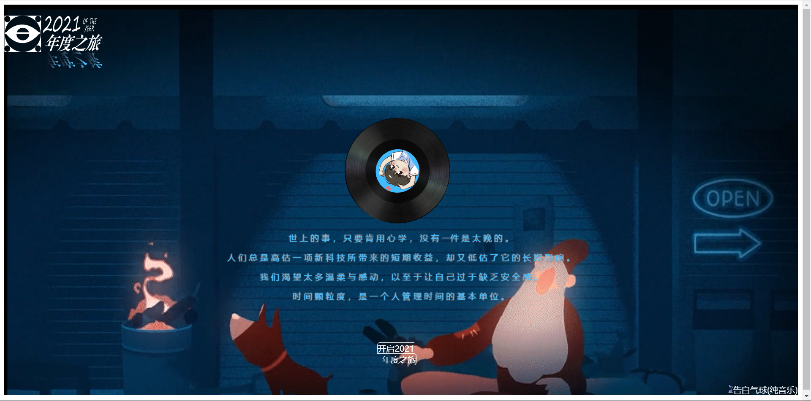
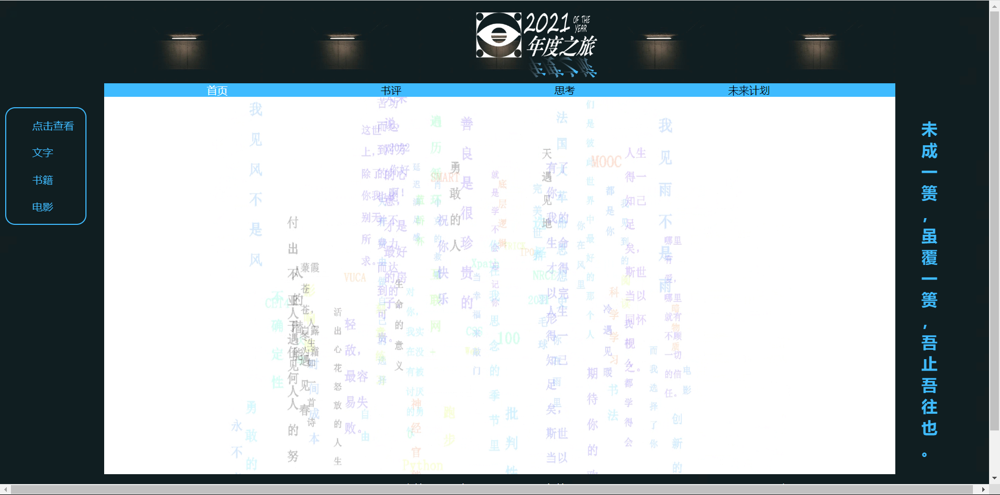
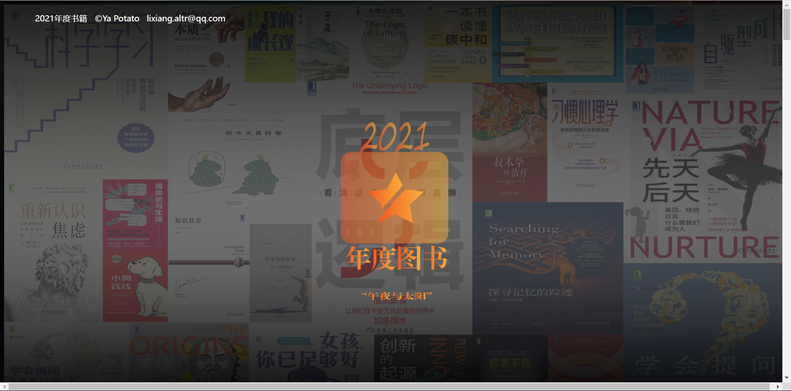
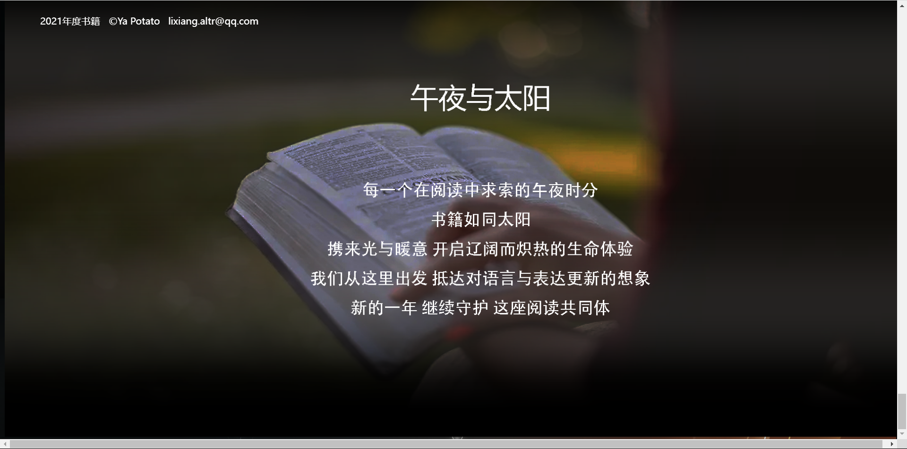
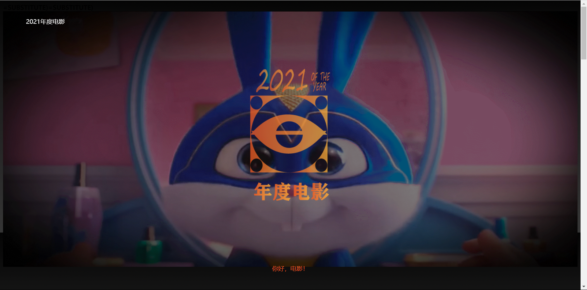
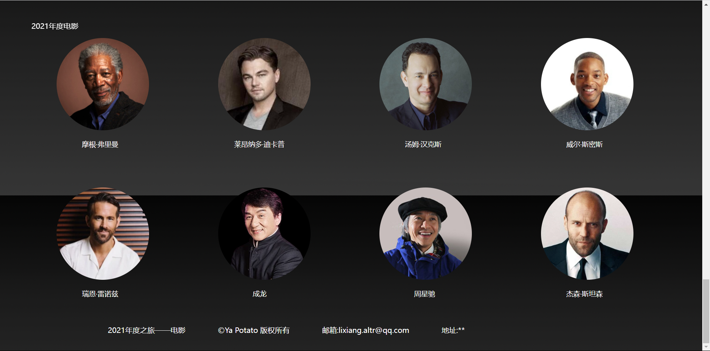

本项目是我2021年初学计算机的HTML时老师要求所做的网页大作业。

# 效果展示

# Video数据

[点击链接下载](https://pan.baidu.com/s/11BeKO86NbaGLWYt2ILkFkg?pwd=ykqp)

---

# 设计目的

早在本年七月份就已在准备建立一个属于自己的网页，三个月的时间依然没有头绪，这期间有思考过做一个纪念日的网页，但整体构思下来，没有一个好的页面设计。

恰好，近开学时得知所报专业亦有网页设计课程，故至七月起就在筹备作甚网页。

在思考设计纪念网页时，已到本年末，却又因此将纪念网页搁置一旁，转念以“年度”为核心，以网页的形式，总结自己在本年中的所得、所想及所感。

# 设计题目

《2021年度之旅》

主要是2021年中的回顾之旅，有关阅读、电影、书评、成长及未来计划等。

# 结构设计

选定主题，确定题目之后，在做整个网站之前对网站进行需求分析。首先，根据2021年度，进行回顾，收集本年中阅读过的书籍、观看的电影，以及力荐的影片，最喜爱的演员，以及未来计划。

然后，对整个网站进行功能描述，并对网站进行总体规划，接着逐步细化。

我的设计主题是2021年度，包括多个方面，框架为：

首先是首页，首页下是背景图片（GIF格式），采用与整体框架相符合的颜色，缓慢的节奏感。 首页主要以开始页面的形式展示。

需要点击碟片下的“开启2021年度之旅”后链接到下一页，则是中间用JS技术呈现出文字以中轴旋转，并且部分文字淡入淡出效果；里面的文字则是在2021本年度所收获的部分知识点，其中包括论语等经典语句在其中；

其次，在网页的左侧及右侧均加入了固定文字，任意改变网页大小，网页中的内容都会随之改变，并且左右侧的文字在上下滑动时均固定不移动。

其中本页的蓝色条区域，有文字隐藏在其中，需鼠标滑动后才会呈现。

# 技术分析

设计技术主要包括：html语言、JavaScript、、CSS、插件技术。

基本的用得到的基础技术如下：

## 建立布局

在这次的网页设计中用到大量的布局，所以怎么样建立布局是关键。本次使用的是Dreamweaver 2022版本。

## 网页中的图像

一是直观，人眼观看图像时接受信息的速度远远超过观看文字时接受信息的速度；

二是能更清楚地表达细节内容。正是由于这些优点，所以在进行网页设计时图像很受欢迎。

图像文件的格式有几十种，如GIF、JPEG、PNG

文字的呈现效果以浮动的方式，确保文字能够正确的呈现出居于图片右下角的样式。

## 图片来源

使用PhotoShop2022以及Illustrator 2022版本

另外，为了使图片更符合要求，还在Illustrator中对矢量图进行更真实的设计，使得图片看起来更加精细美观，符合网页的主题要求。

（1）使用背景图像

使用背景图像使用暗调的亮度，使整个页面看上去带有庄重的视觉体验。

（2）设置鼠标经过文字，进行交互

在文字中有一项是“鼠标经过”，鼠标划过这一项，会颜色会改变颜色，鼠标“确定”即可。

（3）设置链接

选中文字，点击嵌有链接的文字，同时，下方的目标属性被激活，点击后在新窗口中打开网页。

# 设计风格

页面的设计风格，每个人的审美观都不同，所以中国、韩国和欧洲的风格完全不同，但是我发现简约美，不管审美观怎么样不同，至少不会说他难看，而我本人也比较喜欢简单的风格，所以我选择了简约的设计风格，不追求浮夸，只求简单实用，并且我认为网页设计应该注重实用性，因为它是让人浏览的，是用户可以抚摸，因此我提倡简单的美。

## 网页视觉效果

所谓视觉形象识别，就是指能够被目标客户通过视觉来认知与企业相关的一切事物，从最基础的企业标志、吉祥物、标准色到企业日常业务中的信纸、服装、名片等等，而我对视觉的要求主要是色彩和视觉风格，色彩我选择主色调为红色和白色，副色调为蓝色，贴图为各种篮球图片，主要体现出热情的感觉。

## 网页的整体布局和导航

网页的布局通常指的是网页的整体架构，说的通俗一点就是排版。如何突出最重要的内容，即让用户第一眼就看到这个网页所想要传达的信息。这一点至关重要。

所以我的首页采用封面和动态型，便于浏览和点链接；首页内容精彩丰富，简洁明快。页面可爱清爽。首页主要是导航作用。首页制作时，时刻考虑着网页的基本原则：统一，连贯，分割，对比及和谐的原则，内容统一，都是为了主题服务，一个网站强调的就是一个整体，只有围绕一个统一的目标所做的设计才是成功的；连贯，页面之间关系连贯，统成一体；每版内容都自成一体，颜色各异，便于浏览；整个网页有动有静，颜色不同，形成对比，不呆板，富有生气；颜色各异，但又不同之中又相同，浑然一体。使用方便:同第一个是相一致的，满足使用者的要求，网页做得越适合使用，就越显示出其功能美；页面用色协调，布局符合形式美的要求:布局有条理，充分利用美的形式，是网页富有可欣赏性，提高档次。当然雅俗共赏是人人都追求的。同时将动态网页与静态网页结合起来。利用我们所学的框架集，制作更完美的页面。

# 结语

转眼间，已到了期末，学习网页设计这门课程也要结束了，虽然时间有点短，但是学过后，受益匪浅。

记得最初接触Dreamweaver的时候，我很茫然，因为刚接触变成软件心里会很怕学不会。刚开始几节课，老师讲得比较基础，还能跟得上。

老师布置的第一个任务，根据给到的素材，做一个与书中的卡梅隆网站。由于学习的时间较短，但也要求设计感强，色彩搭配和谐，并且尽可能的做成实用又符合实际的漂亮网页。

用Dreamweaver做一个比较接近真实的网页，还要做一个二级页面。于是开始收集各方面的资料。确定了主题就开始布局了。最开始使用了导航栏的样式，但发现不符合主题，接着就把通过Ps和Ai处理设计一个Logo，并且与每一个页面设计相对应的Logo。

总体来说，通过这对网页设计的学习，已经迈入了网页设计的大门，只要我再认真发奋的去学习，在今后的闲余时刻学习制作网页的更多知识以实现自身技能的提高，我坚信将来设计出的网页会更加专业，更加华丽，使它最终成为自己的一项技能。

 # HTML-WEB-Assignment
